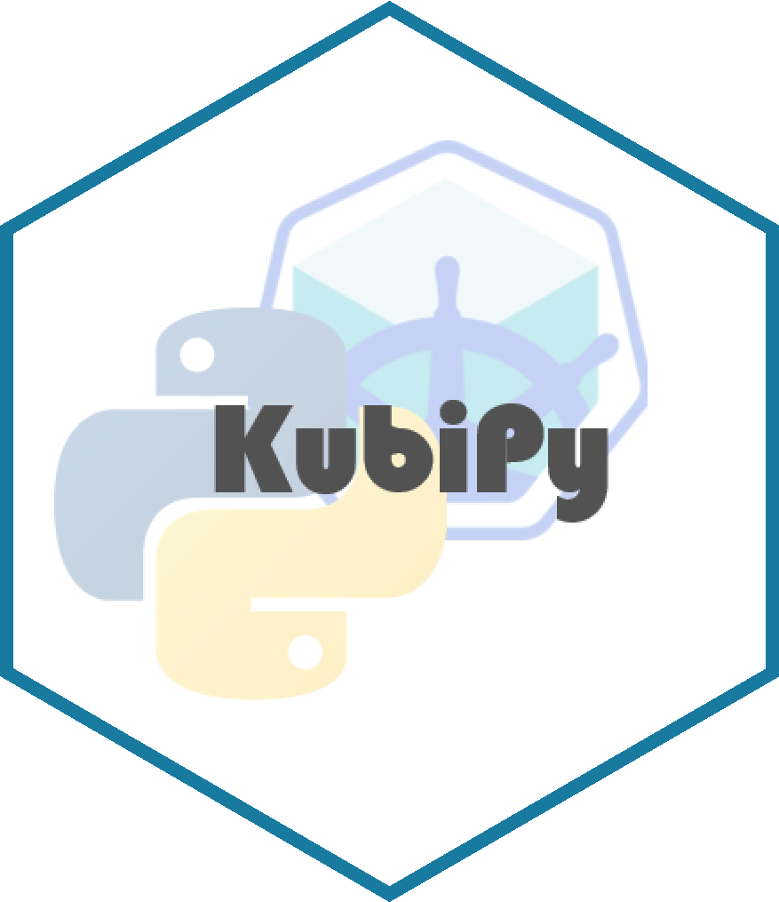

# KubiPy - macOS Python manager for Minikube 

KubiPy helps you to manage Minikube clusters on macOS, all without leaving Python. It provides an interface to Minikube and allows you to setup and manage a cluster. This is immensively helpful to enable local testing of Python applications, before shipping them to a fully-fledged Kubernetes Cluster. This way, you generate a local Kubernetes test environment in a matter of minutes.

The KubiPy interface allows you to not only install Minikube and all components, but also coordinates and sporns all components.

## Usage

KubiPy is available on PyPi as <code>kubipy</code>. So you can run your regular <code>pip</code> command.

    pip install kubipy

KubiPy provides the <code>minipy()</code> class. Once initiated this class is the core of all your operations. While running these commands you will need your sudo password, so keep it close by.

    # initiate the class 
    cluster = minipy()

    # install minikube
    cluster.install()

    # start the cluster
    cluster.start()

    # open the dashboard
    cluster.dashboard()

    # stop the cluster
    cluster.stop()

    # delete minikube
    cluster.delete()

## Dependencies

Minikube depends on numerous components to run. The provision and configuration of these components is handled by KubiPy. However, you should be aware of what happens. 

<ol>
    <li>KubiPy needs a container technology to containerize scripts. To do so, KubiPy installs <a href="https://docs.docker.com/">Docker</a>.</li>
    <li>KubiPy installs a driver that is needed to host a Kubernetes cluster on your machine. KubiPy uses <a href="https://www.virtualbox.org/">VirtualBox</a> to do so.</li>
    <li>KubiPy relies on the Kubernetes-CLI <code>kubectl</code>. This is installed using the package manager <code>Homebrew</code> for macOS.</li>
    <li>KubiPy of course relies on <code>Minikube</code>. This is installed via <code>Homebrew</code> as well.</li>
</ol>

## Stage of Development

KubiPy is under active development and <b>supports</b> currently only <b>macOS</b>. At the moment KubiPy provides the necessary functionalities to setup, start and shut down Minikube on your local machine. The functions include:

<ul>
    <li><code>install()</code></li>
    <li><code>start()</code></li>
    <li><code>stop()</code></li>
    <li><code>dashboard()</code></li>
    <li><code>status()</code></li>
    <li><code>delete()</code></li>
</ul>

## Next Steps

### Version 1.0
<ul>
    <li>Minikube project management</li>
    <li>Minikube service management</li>
    <li>Docker image creation</li>
    <li>Docker image pushing</li>
    <li>API deployment to minikube</li>
</ul>

### Version 2.0
<ul>
    <li>Linux Support: CentOS, Ubuntu, Debian</li>
</ul>