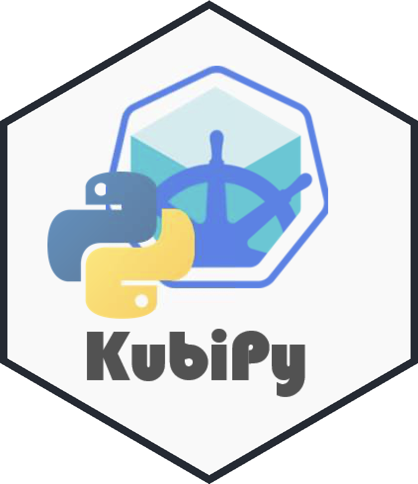

# KubiPy - Orchestrate Kubernetes from Python 

KubiPy helps you to manage your local Kubernetes Cluster fully from Python. It provides an interface to Minikube and allows you to setup and manage a cluster without leaving Python. This is immensively helpful to enable local testing. You can install the library via pip: <code>pip install kubipy</code>.

## Usage

KubiPy provides a standard Python interface to the setup process of your local Kubernetes cluster. KubiPy provides the <code>minipy()</code> class. Once initiated this class is the core of all your operations. While running these commands you will need your sudo password, so keep it close by.

    # initiate the class 
    cluster = minipy()

    # install minikube
    cluster.install()

    # start the cluster
    cluster.start()

    # open the dashboard
    cluster.dashboard()

    # stop the cluster
    cluster.stop()

    # delete minikube
    cluster.delete()

## Dependencies

Minikube depends on numerous components to run. The provision and configuration of these components is handled by KubiPy. However, you should be aware of what happens. 

<ol>
    <li>KubiPy installs a driver that is needed to host a Kubernetes cluster on your machine. KubiPy uses <a href="https://www.virtualbox.org/">VirtualBox</a> to do so.</li>
    <li>KubiPy relies on the Kubernetes-CLI <code>kubectl</code>. This is installed using the package manager <code>Homebrew</code> for macOS.</li>
    <li>KubiPy of course relies on <code>Minikube</code>. This is installed via <code>Homebrew</code> as well.</li>
</ol>

## Stage of Development

KubiPy is under active development and <b>supports</b> currently only <b>macOS</b>. At the moment KubiPy provides the necessary functionalities to setup, start and shut down Minikube on your local machine. The functions include:

<ul>
    <li><code>install()</code></li>
    <li><code>start()</code></li>
    <li><code>stop()</code></li>
    <li><code>dashboard()</code></li>
    <li><code>delete()</code></li>
</ul>

## Next Steps

### Version 0.2
<ul>
    <li>Extend to Ubuntu 19.10 & 18.04</li>
    <li>Extend to CentOS 7 & 8</li>
</ul>

### Version 0.3
<ul>
    <li>Kubectl config management</li>
    <li>Minikube project creation</li>
    <li>Minikube project management</li>
    <li>Docker container creation</li>
</ul>

### Version 1.0
<ul>
    <li>API deployment to minikube</li>
</ul>